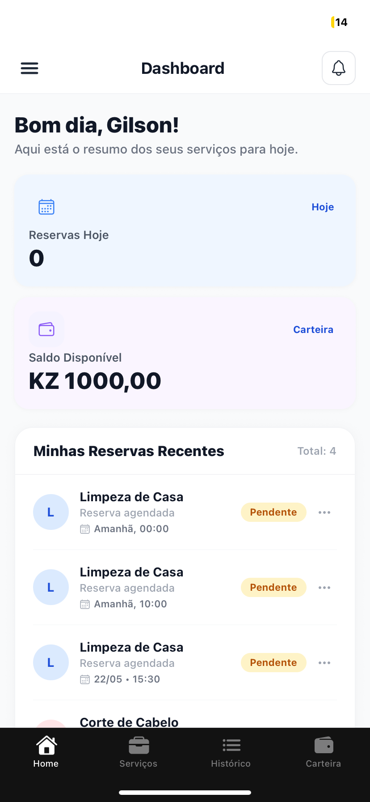
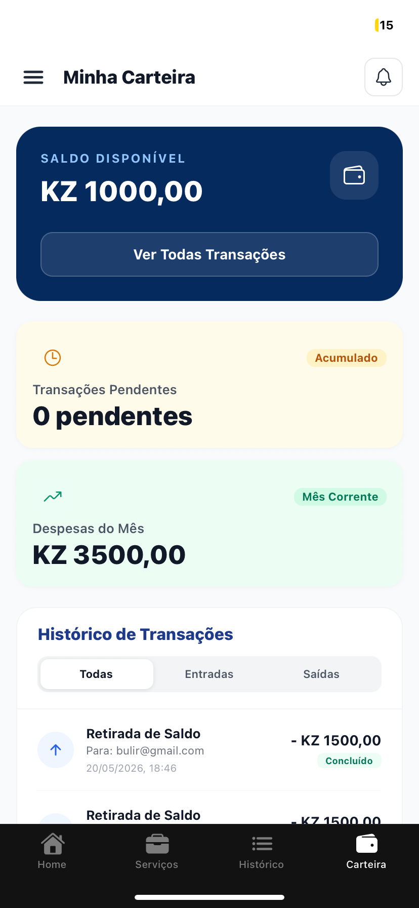
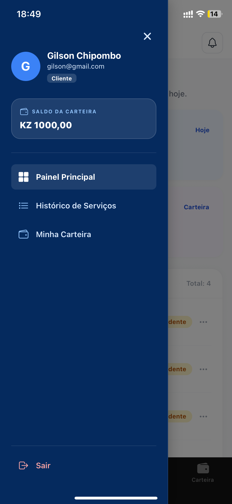
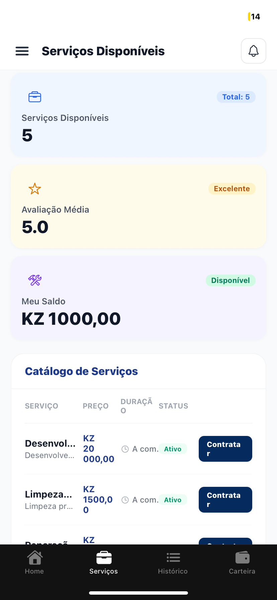
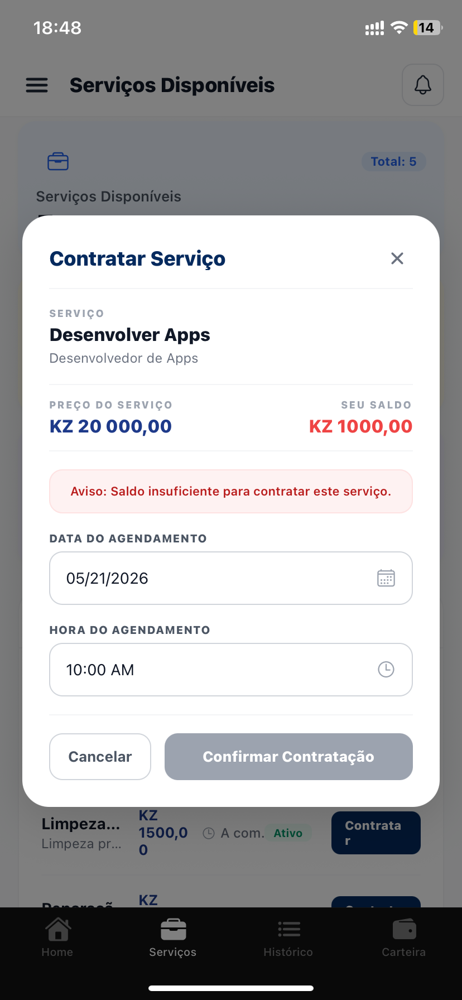
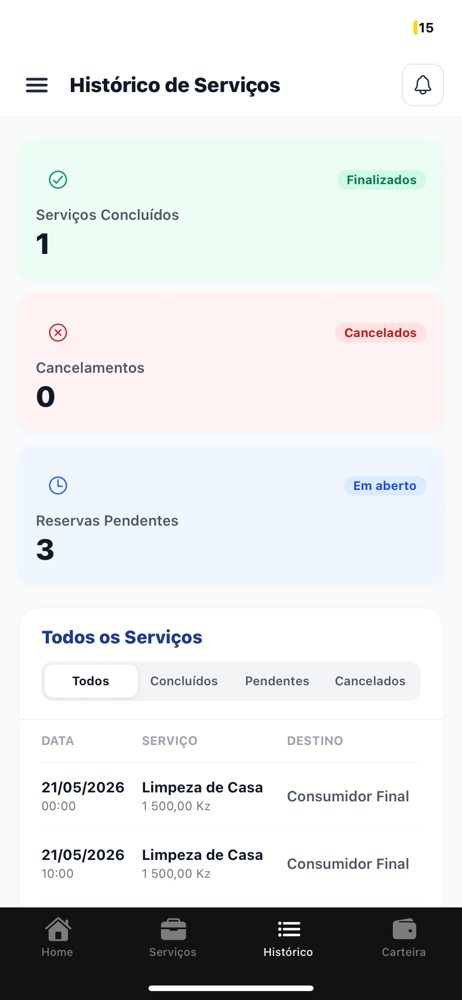

# Bulir - Desafio 3:  ServiceFind Mobile - Marketplace de Serviços

Uma aplicação mobile multiplataforma (iOS, Android e Web) para conectar clientes com prestadores de serviços. ServiceFind é um marketplace completo com sistema de agendamentos, carteira digital e gerenciamento de serviços.


---

## 📸 Screenshots

### Capturas de tela do app

| Imagem 1 | Imagem 2 | Imagem 3 | Imagem 4 |
|----------|----------|----------|----------|
|  |  |  |  |

### Dashboard e Gerenciamento

| Imagem 5 | Imagem 6 | Imagem 7 |
|----------|----------|----------|
|  |  |  |

---

### Plataformas Suportadas
-  **iOS** (com suporte a iPad)
- **Android** (com edge-to-edge UI)
- **Web** (output estático)

---

## Instalação

### Pré-requisitos
- Node.js 18+
- npm 
- Expo CLI: `npm install -g expo-cli`
- iOS: Xcode (macOS)
- Android: Android Studio

### Passo 1: Clonar o Repositório

```bash
git clone <repository-url>
cd Desafio-3
```

### Passo 2: Instalar Dependências

```bash
npm install

```

### Passo 3: Configurar Variáveis de Ambiente

Crie um arquivo `.env.local` na raiz do projeto:

```env
EXPO_PUBLIC_API_URL=https://desafio-1-dgfd.onrender.com

```
---

## 🔐 Autenticação

### Fluxo de Autenticação

```typescript
// Login 1: Prestador de Serviço

  email: "bulir@gmail.com",
  password: "123456"
```
```typescript
// Login 2: Cliente

  email: "gilson@gmail.com",
  password: "123456"
```
---

### Passo 4: Executar a Aplicação

#### Desenvolvimento Web
```bash
npx expo start
# Pressione 'w' para abrir no browser
```

#### iOS (macOS)
```bash
# Pressione 'i' para abrir no iOS Simulator
```

#### Android
```bash
# Pressione 'a' para abrir no Android Emulator
```

#### Compilar para Produção

**iOS:**
```bash
eas build --platform ios
```

**Android:**
```bash
eas build --platform android
```


## Features

### Autenticação & Autorização
- Registro diferenciado para Client e Provider (com NIF)
- Autenticação com email/password
- Tokens JWT com persistência
- Middleware de proteção de rotas
- AuthContext customizado com hooks

### 📱 Dashboard Mobile
- Home com estatísticas (saldo, agendamentos próximos)
- Abas de navegação (Home, Clientes, Serviços, Carteira, Histórico)
- Gerenciamento responsivo em mobile e tablet
- Design nativo (edge-to-edge)

###  Sistema de Agendamentos
- Agendar serviços com data/hora
- Visualizar agendamentos do cliente e prestador
- Cancelar agendamentos
- Histórico de agendamentos

### Carteira Digital
- Saldo em tempo real
- Histórico de transações
- Transações enviadas e recebidas
- Integração com sistema de agendamentos

### Gerenciamento de Serviços (Provider)
- Criar novo serviço
- Editar serviço existente
- Deletar serviço
- Visualizar meus serviços
- Listar todos os serviços disponíveis

### Gerenciamento de Clientes
- Visualizar clientes que contrataram (Provider)
- Histórico de interações
- Avaliações e ratings

### Interface
- Design responsivo (mobile-first)
- Dark mode suportado
- Navegação com abas nativas
- Componentes customizados
- Animações suaves

---

## 🛠 Tech Stack

### Framework & Core
| Tecnologia | Versão | Uso |
|-----------|--------|-----|
| **React Native** | 0.81.5 | Framework mobile |
| **Expo** | 54.0.33 | Plataforma de desenvolvimento |
| **Expo Router** | ~6.0.23 | Roteamento baseado em arquivos |
| **React** | 19.1.0 | Biblioteca UI |
| **React Navigation** | ~7.x | Navegação nativa |
| **TypeScript** | 5.9 | Type safety |


### Fluxo de Dados

```
┌──────────────────────────────────────┐
│      LOGIN / REGISTER                │
└──────────────────────────────────────┘
                 ↓
┌──────────────────────────────────────┐
│   authService.login() / register()   │
└──────────────────────────────────────┘
                 ↓
┌──────────────────────────────────────┐
│   API Backend (/auth/login)          │
└──────────────────────────────────────┘
                 ↓
┌──────────────────────────────────────┐
│  Token + User Data (JWT)             │
│  → setApiToken(token)                │
│  → useAuth.setUser(user)             │
└──────────────────────────────────────┘
                 ↓
┌──────────────────────────────────────┐
│      ABAS DO DASHBOARD               │
│  ├─ Home (stats)                     │
│  ├─ Serviços                         │
│  ├─ Clientes (PROVIDER)              │
│  ├─ Carteira                         │
│  └─ Histórico                        │
└──────────────────────────────────────┘
                 ↓
┌──────────────────────────────────────┐
│    API Interceptor + Bearer Token    │
└──────────────────────────────────────┘
                 ↓
┌──────────────────────────────────────┐
│   API Backend (Protected Routes)     │
│  ├─ /api/v1/services                 │
│  ├─ /api/v1/bookings                 │
│  ├─ /api/v1/wallet                   │
│  └─ /api/v1/users                    │
└──────────────────────────────────────┘
```

#
---

---
### Fluxo de Registro

#### Cliente
1. Abra a aplicação
2. Clique em "Não tem conta? Registre-se"
3. Selecione "Sou Cliente"
4. Preencha: Nome, Email, Telefone, Senha
5. Clique em "Registrar"

#### Prestador de Serviços
1. Abra a aplicação
2. Clique em "Não tem conta? Registre-se"
3. Selecione "Sou Prestador"
4. Preencha: Nome, Email, NIF, Telefone, Senha
5. Clique em "Registrar"

### Fluxo de Login

1. Na tela inicial, insira Email e Senha
2. Clique em "Entrar"
3. Você será redirecionado para o Dashboard

### Navegação no Dashboard

O dashboard possui 5 abas principais:

#### **Home** 
- Visualizar saldo disponível
- Ver agendamentos próximos
- Estatísticas de atividade
- Quick actions

#### **Serviços** 🛠
- **Cliente**: Buscar e visualizar serviços disponíveis
- **Provider**: Gerenciar seus serviços (criar, editar, deletar)
- Detalhes completos do serviço
- Botão para agendar (Client) ou editar (Provider)

#### **Clientes** *(Provider only)*
- Lista de clientes que contrataram
- Histórico de interações
- Avaliações recebidas

#### **Carteira** 
- Saldo disponível
- Resumo de transações recentes
- Botão para ver histórico completo

#### **Histórico**
- Histórico completo de transações
- Filtrar por tipo (enviadas/recebidas)
- Detalhes de cada transação

---

## Estrutura do Projeto

### Configuração de Roteamento

#### Public Routes (sem autenticação)
- `/login` - Página de login
- `/register` - Página de registro

#### Protected Routes (com autenticação)
- `/` (tabs) - Dashboard com abas
  - `index` - Home
  - `clientes` - Clientes
  - `servicos` - Serviços
  - `carteira` - Carteira
  - `historico` - Histórico
- `/criar-servico` - Criar novo serviço


## API Endpoints

### Autenticação
```
POST /api/v1/auth/register/client
POST /api/v1/auth/register/provider
POST /api/v1/auth/login
```

### Serviços
```
GET    /api/v1/services
POST   /api/v1/services
GET    /api/v1/services/:id
PUT    /api/v1/services/:id
DELETE /api/v1/services/:id
GET    /api/v1/services/my-services
```

### Agendamentos
```
GET    /api/v1/bookings/my-bookings
GET    /api/v1/bookings/provider-bookings
POST   /api/v1/bookings
DELETE /api/v1/bookings/:id
```

### Carteira
```
GET /api/v1/wallet/balance
GET /api/v1/wallet/transactions
GET /api/v1/wallet/transactions/received
GET /api/v1/wallet/transactions/sent
```

### Usuários
```
GET    /api/v1/users/me
PUT    /api/v1/users/:id
```

---

## Dependências Principais

### Produção
```json
{
  "react-native": "0.81.5",
  "expo": "54.0.33",
  "expo-router": "~6.0.23",
  "react": "19.1.0",
  "react-navigation": "~7.x",
  "typescript": "5.9",
  "axios": "1.16"
}
```

### Desenvolvimento
```json
{
  "@types/react": "^19",
  "@types/react-native": "^0.81",
  "eslint": "^9"
}
```

---

---

## 📄 Licença

Este projeto está licenciado sob a [MIT License](LICENSE).


## Versão

- **Versão Atual**: 0.1.0
- **Expo Version**: 54.0.33
- **React Native Version**: 0.81.5
- **Última Atualização**: Maio 2026
- **Status**: Em Desenvolvimento

---

## Author
   Gilson Chipombo

